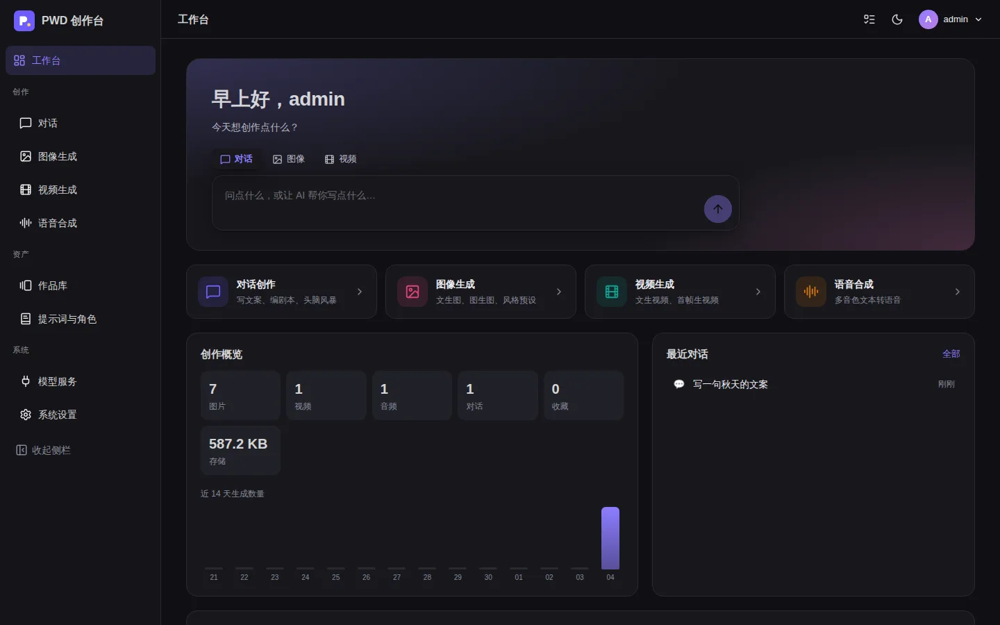
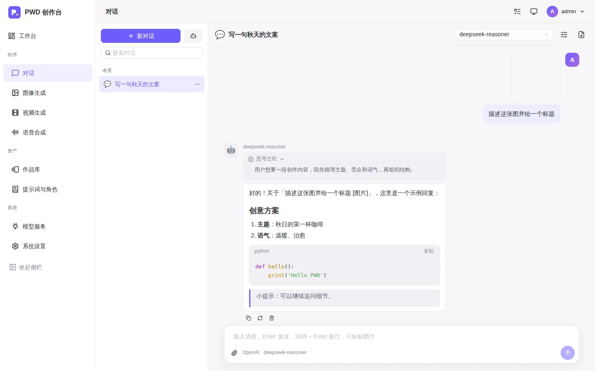
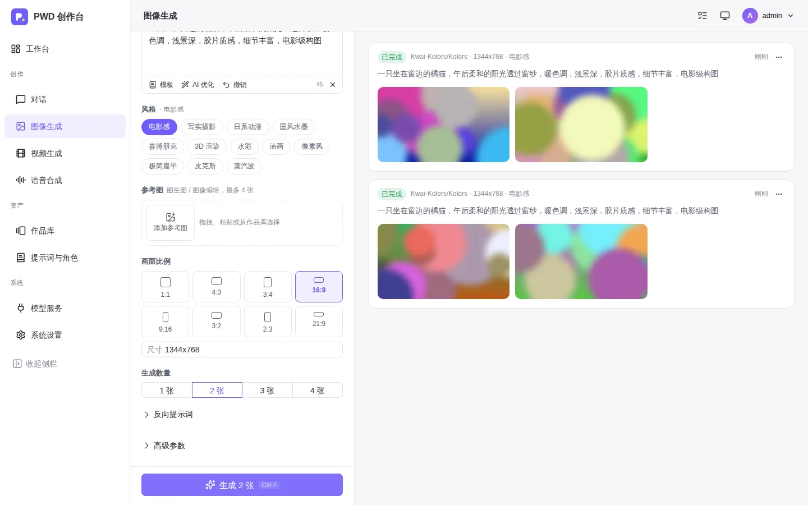
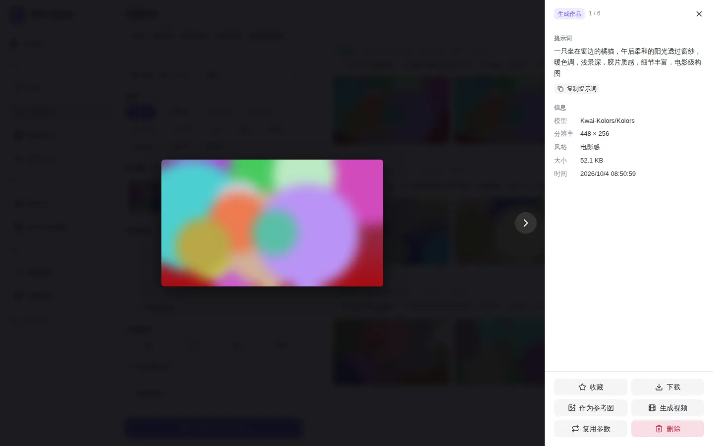
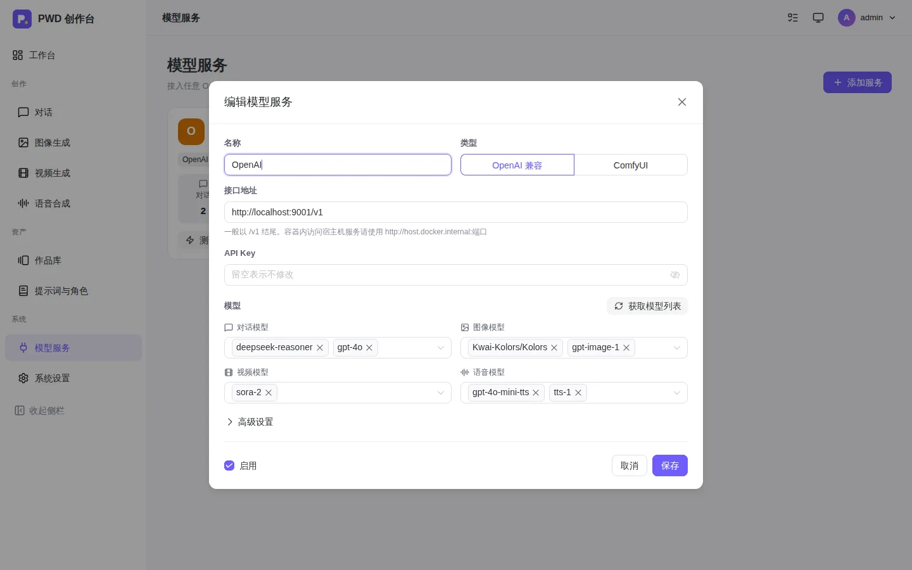

# PWD · 个人 AIGC 创作平台

可自托管的个人 AIGC 创作工作室：**对话写作、图像生成、视频生成、语音合成**，作品与提示词统一沉淀在一个地方。
**Docker / Podman 一键部署，零必填环境变量**，启动后在浏览器的安装向导中完成全部配置，数据完全保存在你自己的服务器上。



## 功能

### 创作

| 模块 | 能力 |
|---|---|
| 💬 **对话** | 多会话、流式输出、Markdown 与代码高亮；**识图**（粘贴 / 拖拽图片给视觉模型）；**推理过程**展示（DeepSeek-R1 等 `reasoning_content` 与 `<think>`）；**对话分支**（编辑任意消息或对任意回答重新生成都会保留原版本，可随时 ‹ 1/2 › 切换）；**多模型对比**（同一问题同时问 2～4 个模型，回答并排展示，选用其一继续对话）；中途停止；会话**置顶 / 搜索 / 按日期分组 / AI 命名 / 导出 Markdown**；每个对话独立的角色设定与模型参数（温度、Top P、最大长度、上下文条数） |
| 📚 **知识库** | 上传 PDF、Word、PPT、Excel、Markdown、TXT、HTML、EPUB 等文档建立知识库；配置向量模型时使用**语义检索**，未配置时使用关键词检索（无需任何模型）；对话中勾选知识库后自动检索并**标注引用来源** |
| 🧰 **工具与联网** | **联网搜索**（SearXNG / Tavily / 博查），回答附带来源链接；**工具调用**：模型可在对话中直接生成图片、联网搜索、检索知识库；接入 **MCP 服务**（Streamable HTTP）扩展任意工具；对话中可直接附带文档；**语音输入** |
| 🎨 **图像** | 文生图、**图生图 / 图像编辑**（上传、粘贴、拖拽或从作品库选参考图）；**12 种风格预设**；**AI 优化提示词**；可视化画幅比例、批量生成、种子、反向提示词、额外请求参数；结果一键「作为参考图」继续迭代；**多模型对比生成** |
| 🪄 **图像编辑** | 在作品上直接编辑并另存为新作品：**局部重绘**（画笔涂抹蒙版、擦除、反选、撤销）、**扩图**（四周扩展 / 一键转 16:9、9:16、1:1）、**高清放大**（本地 Lanczos 免费放大，或 ComfyUI 放大模型）、**去除背景**；支持 OpenAI `/images/edits` 与 ComfyUI 工作流 |
| 🎬 **视频** | 文生视频、**首帧图生视频**；支持 OpenAI Sora 风格（`/videos`）与硅基流动（`/video/submit`）两种异步接口及 ComfyUI 视频工作流；进度显示，可离开页面，完成后通知 |
| 🔊 **语音** | OpenAI 兼容 `/audio/speech`：多音色（含硅基流动 CosyVoice）、语速、输出格式、语气指令 |

### 管理

| 模块 | 能力 |
|---|---|
| 🖼️ **作品库** | **作品集**（按项目 / 主题归类，批量移入）；按真实比例排布的瀑布流、无限滚动；按类型 / 来源 / 模型 / 收藏筛选与搜索；**多选批量收藏、打包下载、删除**；大图查看器展示完整生成参数，可「复用参数」「作为参考图」「生成视频」；拖拽上传素材；自动生成缩略图 |
| 📝 **提示词与角色** | 内置 **100 个对话角色、100 个图像提示词、100 个视频提示词**，按分组筛选与搜索；支持**模板变量** `{{主题}}` / `{{风格|默认值}}`，使用时弹出表单填写；可保存个人模板，管理员可共享模板给所有用户；创作页与对话页一键调用 |
| 👥 **多用户** | 管理员 / 普通用户两种角色；管理员可添加用户、重置密码、禁用、删除；可开放注册并设置是否需要审核；各用户的对话、作品、任务、个人模板相互隔离，模型服务由管理员统一配置 |
| 🛡️ **用户组与配额** | 按用户组限制可用的能力（对话 / 图像 / 视频 / 语音）与**模型白名单**；设置**每日对话条数、图片张数、视频个数、语音条数与每月 Token 上限**；新注册用户可自动加入默认组 |
| 📊 **用量统计** | 记录每次对话与生成的用量（优先使用服务返回的真实 Token 数，缺失时按字数估算）；管理员可查看每日趋势、按用户 / 按模型汇总；用户可在「我的用量」查看剩余额度 |
| 🔁 **故障切换** | 请求遇到网络错误、限流（429）或 5xx 时，自动切换到提供**同名模型**的其他服务，按优先级尝试；对话中会标注实际提供服务的渠道 |
| 🔐 **安全** | **两步验证**（TOTP，兼容各类验证器 App）；**OIDC 单点登录**（Authentik / Keycloak / Logto / Casdoor 等，支持自动建号与已有账号绑定）；**操作日志**（登录、权限、模型服务与系统设置变更） |
| 🔌 **模型服务** | 任意 **OpenAI 兼容接口**（OpenAI、DeepSeek、硅基流动、阿里百炼、火山方舟、OpenRouter、Ollama、One API / New API…）与 **ComfyUI**；一键获取模型列表并**按名称自动归类**为对话 / 图像 / 视频 / 语音；ComfyUI 支持多工作流、导入 JSON、内置文生图 / 局部重绘 / 放大示例工作流 |
| 🧭 **任务中心** | 顶栏实时显示进行中的生成任务，可取消；任务完成 / 失败时弹出通知；失败任务一键重试 |
| ⚙️ **系统** | 浅色 / 深色 / 跟随系统主题与 5 种主题色；各能力默认模型、提示词优化模型；修改密码；**一键完整备份**（数据库快照 + 媒体文件） |

<table>
<tr><td></td><td></td></tr>
<tr><td></td><td></td></tr>
</table>

## 部署

### 方式一：docker compose（推荐）

```bash
mkdir pwd && cd pwd
curl -O https://raw.githubusercontent.com/oaly69/PWD/main/docker-compose.yml
docker compose up -d
```

### 方式二：docker run

```bash
docker run -d --name pwd --restart unless-stopped \
  -p 8080:8080 \
  -v $(pwd)/data:/data \
  --add-host host.docker.internal:host-gateway \
  ghcr.io/oaly69/pwd:latest
```

然后浏览器访问 `http://服务器IP:8080`，按安装向导完成设置即可。

### 方式三：Podman

完全支持 Podman（含 rootless 无 root 运行），并提供 systemd 开机自启的 Quadlet 文件，详见下方 [使用 Podman 部署](#使用-podman-部署)。

### 环境变量（全部可选）

| 变量 | 默认值 | 说明 |
|---|---|---|
| `PWD_INSTALL_TOKEN` | 空 | 设置后，安装页必须输入该令牌才能完成安装。**部署到公网时强烈建议设置**，防止他人抢先安装 |
| `PWD_PORT` | `8080` | 容器内监听端口 |
| `PWD_DATA_DIR` | `/data` | 数据目录（数据库、生成文件、会话密钥） |
| `TZ` | `Asia/Shanghai` | 时区 |

其余参数（管理员账号、模型服务、API Key、默认模型等）全部在 Web 界面中设置，保存在 `/data/pwd.db`。

### 数据与备份

所有数据都在挂载的 `data` 目录中：

```
data/
├── pwd.db        # SQLite 数据库（配置、对话、任务、作品索引）
├── media/        # 生成与上传的文件
├── thumbs/       # 缩略图缓存（可随时删除，会自动重建）
└── .secret_key   # 会话签名密钥（首次启动自动生成）
```

两种备份方式：在「系统设置 → 数据与备份」中一键下载完整备份 zip；或停止容器后直接复制整个 `data` 目录。恢复时把备份内容放回数据目录再启动即可。

### 更新

```bash
docker compose pull && docker compose up -d
```

### 连接宿主机上的 Ollama / ComfyUI

compose 文件已配置 `host.docker.internal`，在模型服务中填写：

- Ollama：`http://host.docker.internal:11434/v1`
- ComfyUI：`http://host.docker.internal:8188`（ComfyUI 需以 `--listen` 启动）

### 反向代理

放在 Nginx 等反代之后时，需关闭对话接口的缓冲以保证流式输出（服务端已发送 `X-Accel-Buffering: no`，一般无需额外配置）：

```nginx
location / {
    proxy_pass http://127.0.0.1:8080;
    proxy_set_header Host $host;
    proxy_set_header X-Forwarded-For $proxy_add_x_forwarded_for;
    proxy_set_header X-Forwarded-Proto $scheme;
    proxy_buffering off;
    client_max_body_size 64m;
}
```

## 模型配置指南

在「模型服务」中添加服务后，点击「获取模型列表」→「自动分类填入」，再按需增删即可。几个常见搭配：

| 服务 | 接口地址 | 对话 | 图像 | 视频 | 语音 | 高级设置 |
|---|---|---|---|---|---|---|
| OpenAI | `https://api.openai.com/v1` | gpt-4o 等 | gpt-image-1 | sora-2 | tts-1、gpt-4o-mini-tts | 图生图：`/images/edits`；视频：OpenAI 风格 |
| 硅基流动 | `https://api.siliconflow.cn/v1` | DeepSeek / Qwen 等 | Kwai-Kolors/Kolors、Qwen-Image | Wan-AI/Wan2.2-T2V-A14B 等 | FunAudioLLM/CosyVoice2-0.5B | 图生图：请求体 image 字段；视频：硅基流动 |
| DeepSeek | `https://api.deepseek.com/v1` | deepseek-chat、deepseek-reasoner | – | – | – | – |
| Ollama | `http://host.docker.internal:11434/v1` | 本地模型（含 llava 等视觉模型） | – | – | – | – |
| ComfyUI | `http://host.docker.internal:8188` | – | 图像工作流 | 视频工作流 | – | 每个工作流标记为「图像」或「视频」 |

- 「AI 优化提示词」默认使用默认对话模型，可在「系统设置 → 默认模型」中单独指定。
- 各家对尺寸、时长等参数支持不同，不支持的参数可通过创作页「额外请求参数」（JSON）直接透传。
- ComfyUI 工作流请在 ComfyUI 中使用「导出 (API)」获取。可用占位符：

  | 占位符 | 说明 |
  |---|---|
  | `{{prompt}}` `{{negative_prompt}}` | 提示词 / 反向提示词 |
  | `{{seed}}` `{{steps}}` `{{width}}` `{{height}}` `{{batch_size}}` | 数值参数（整个字段写成占位符时会替换为数字） |
  | `{{image}}` | 参考图 / 待编辑图，配合 `LoadImage` 节点。局部重绘与扩图时重绘区域为**透明**，`LoadImage` 的 MASK 输出即为蒙版 |
  | `{{mask}}` | 白色 = 重绘区域的蒙版图，配合 `LoadImageMask` 节点（通道选 red） |
  | `{{scale}}` | 放大倍数；放大时 `{{width}}` `{{height}}` 为目标尺寸 |

  「示例工作流」中提供了 SDXL 文生图、局部重绘、4x 放大三个模板，改成你本地已有的模型文件名即可使用。去除背景可接入 RMBG / BiRefNet 等自定义节点，工作流中用 `{{image}}` 作为输入。
- 局部重绘 / 扩图 / 去背景使用 OpenAI 兼容接口时调用 `/images/edits`（需模型支持，如 gpt-image-1）；在模型服务中把「图生图方式」设为请求体传图时，会以 `image` 与 `mask` 字段传入 data URI。

## 知识库、联网搜索与工具

- **知识库**：在「模型服务」中添加向量模型（如 OpenAI `text-embedding-3-small`、硅基流动 `BAAI/bge-m3`）后，新建知识库时选择它即可使用语义检索；不选择时使用关键词检索。已有文档的知识库不能更换向量模型。
- **联网搜索**：在「系统设置 → 搜索与工具」中选择搜索引擎。SearXNG 可自建（需在其 `settings.yml` 的 `search.formats` 中加入 `json`），Tavily、博查需要填写 API Key。
- **MCP 服务**：填写支持 Streamable HTTP 传输的 MCP 服务地址（可附带请求头用于鉴权），点「测试」可查看其提供的工具。工具调用需要模型支持 Function Calling（如 GPT-4o、DeepSeek-V3、Qwen 等）。
- **语音输入**：在「系统设置 → 默认模型」中选择语音识别模型（如 `whisper-1`、`FunAudioLLM/SenseVoiceSmall`）后，对话输入框会出现麦克风按钮。浏览器只允许在 HTTPS 或 localhost 下使用麦克风。

## 单点登录（OIDC）

在「系统设置 → 登录与服务」中开启并填写 Issuer 地址、Client ID 与 Client Secret。在身份服务（Authentik、Keycloak、Logto、Casdoor、Authelia 等）中创建应用时：

- 回调地址（Redirect URI）：`https://你的域名/api/auth/oidc/callback`（设置页会显示完整地址）
- 授权方式：Authorization Code；Scopes：`openid profile email`
- 通过反向代理访问时，建议在设置中填写「站点对外地址」，保证回调地址正确

首次单点登录会按 `preferred_username`（或邮箱前缀）自动创建账号，是否需要审核沿用注册审核设置；关闭自动建号时，已有用户可在「账号安全」中绑定单点登录账号后使用。

## 从旧版本升级

直接拉取新镜像并重建容器即可，**数据库会在启动时自动迁移**（只增加字段，不改动已有数据），登录状态与历史数据全部保留：

- 升级到 v0.6 时，「模型服务」中新增「向量模型」「语音识别模型」两类，可点击「获取模型列表 → 自动分类填入」补充。
- 升级到 v0.5 时，已有用户不属于任何用户组（不受限制），用量统计从升级后开始记录。
- 升级到 v0.4 时，原有对话自动转换为分支结构（原来的线性对话即一条分支），无需任何操作。
- 升级到 v0.3（多用户）时，原有的对话、作品与任务自动归属到原管理员；原管理员自建的提示词模板转为管理员私有，旧版内置示例替换为新版内置模板。
- 新增的内置模板会自动补充，已删除的内置模板不会被加回来。

```bash
docker compose pull && docker compose up -d
```

## 使用 Podman 部署

镜像是标准 OCI 镜像，可直接用 Podman 运行。以下步骤在 **Podman 4.4+** 上验证通过（Quadlet 需要 4.4+）。推荐用普通用户以 rootless 方式运行。

### 0. 安装 Podman

```bash
# Debian / Ubuntu
sudo apt install -y podman
# Fedora / RHEL / Rocky / Alma / CentOS Stream
sudo dnf install -y podman
# 确认版本 ≥ 4.4
podman --version
```

### 1. 快速运行（podman run）

```bash
mkdir -p ~/pwd/data && cd ~/pwd

podman run -d --name pwd --restart unless-stopped \
  -p 8080:8080 \
  -v ~/pwd/data:/data:Z \
  --health-cmd "python -c \"import urllib.request;urllib.request.urlopen('http://127.0.0.1:8080/api/health',timeout=4)\"" \
  --health-interval 30s \
  ghcr.io/oaly69/pwd:latest
```

浏览器打开 `http://服务器IP:8080` 进入安装向导。

说明：

- 镜像名必须写完整的 `ghcr.io/...`，Podman 不会像 Docker 那样默认补全仓库地址。
- 卷后面的 `:Z` 是给 SELinux（Fedora / RHEL 系）用的，没有 SELinux 的系统加上也不影响。
- `--health-cmd` 显式声明健康检查。Podman 用 OCI 格式时可能忽略镜像内的 `HEALTHCHECK`，显式写上更稳妥。
- `--restart` 只在 Podman 服务本身运行时生效，**rootless 下重启机器后不会自动拉起**。需要开机自启请用下面的 Quadlet。

### 2. 开机自启（Quadlet + systemd，推荐）

仓库提供了现成的单元文件 [`deploy/podman/pwd.container`](deploy/podman/pwd.container)。

**普通用户（rootless）：**

```bash
# 1) 准备数据目录和单元文件
mkdir -p ~/pwd/data ~/.config/containers/systemd
curl -o ~/.config/containers/systemd/pwd.container \
  https://raw.githubusercontent.com/oaly69/PWD/main/deploy/podman/pwd.container

# 2) 让 systemd 生成服务并启动（首次会先拉取镜像，需等待片刻）
systemctl --user daemon-reload
systemctl --user start pwd

# 3) 允许该用户退出登录后服务继续运行，并随开机启动
sudo loginctl enable-linger $USER

# 查看状态与日志
systemctl --user status pwd
journalctl --user -u pwd -f
```

> Quadlet 生成的服务不需要也不能执行 `systemctl enable`，单元文件中的 `[Install] WantedBy=default.target` 已经负责开机启动。

**root 用户：** 把文件放到 `/etc/containers/systemd/pwd.container`，并把其中的 `%h/pwd/data` 改成绝对路径（如 `/opt/pwd/data`，需先 `mkdir -p`），然后执行 `systemctl daemon-reload && systemctl start pwd`，命令中去掉 `--user`。

**设置环境变量（如安装令牌）：**

```bash
echo 'PWD_INSTALL_TOKEN=换成你自己的随机字符串' > ~/pwd/.env
# 编辑 ~/.config/containers/systemd/pwd.container，取消 EnvironmentFile= 那一行的注释
systemctl --user daemon-reload && systemctl --user restart pwd
```

### 3. 使用 podman compose（可选）

仓库里的 `docker-compose.yml` 可直接用于 [podman-compose](https://github.com/containers/podman-compose)（1.1+）：

```bash
sudo apt install -y podman-compose   # 或 dnf / pip install podman-compose
mkdir -p ~/pwd && cd ~/pwd
curl -O https://raw.githubusercontent.com/oaly69/PWD/main/docker-compose.yml
podman-compose up -d
```

如果 SELinux 处于开启状态，请把 compose 文件中的 `./data:/data` 改为 `./data:/data:Z`。compose 方式同样不会在重启后自动拉起，长期运行建议用 Quadlet。

### 4. 更新

```bash
# Quadlet 方式
podman pull ghcr.io/oaly69/pwd:latest && systemctl --user restart pwd
# 或启用自动更新（每天检查一次新镜像，单元文件已带 AutoUpdate=registry）
systemctl --user enable --now podman-auto-update.timer

# podman run 方式
podman pull ghcr.io/oaly69/pwd:latest
podman rm -f pwd   # 数据在 ~/pwd/data，不会丢失
# 然后重新执行上面的 podman run 命令
```

### 5. 常见问题

- **其他机器访问不了 8080**：放行防火墙端口。firewalld 用 `sudo firewall-cmd --add-port=8080/tcp --permanent && sudo firewall-cmd --reload`，ufw 用 `sudo ufw allow 8080/tcp`。
- **想用 80 / 443 端口**：rootless 默认不能绑定 1024 以下端口。建议保持 8080 并在前面加 Nginx / Caddy 反向代理，或者执行 `sudo sysctl net.ipv4.ip_unprivileged_port_start=80`。
- **连接宿主机上的 Ollama / ComfyUI**：Podman 会自动解析 `host.containers.internal` 和 `host.docker.internal`，模型服务地址填 `http://host.containers.internal:11434/v1` 即可。注意宿主机服务必须监听外部地址，不能只监听 `127.0.0.1`：Ollama 设置 `OLLAMA_HOST=0.0.0.0`，ComfyUI 加 `--listen` 参数启动。
- **拉取镜像提示 unauthorized / denied**：GHCR 包仍是私有的。到 GitHub 把包设为 Public，或先执行 `podman login ghcr.io`，用户名为 GitHub 账号，密码为带 `read:packages` 权限的 Personal Access Token。
- **数据目录权限**：rootless 容器内的 root 对应宿主机上的当前用户，所以 `~/pwd/data` 里的文件归你自己所有，直接备份或复制即可。

## 镜像构建（GitHub Actions）

- `.github/workflows/docker.yml`：推送到 `main` 构建 `latest`；推送 `v*` 标签构建版本号镜像；也可在 Actions 页面手动触发。构建 `linux/amd64` 与 `linux/arm64` 双架构，推送至 `ghcr.io/<owner>/<repo>`。
- `.github/workflows/ci.yml`：PR 与非 main 分支运行后端测试与前端构建。

> 首次推送后 GHCR 包默认为私有。如需免登录拉取，请在 GitHub 仓库主页右侧 **Packages → pwd → Package settings → Change visibility** 设为 Public。

## 本地开发

```bash
# 后端（Python 3.11+）
cd backend
python -m venv .venv && . .venv/bin/activate
pip install -r requirements-dev.txt
uvicorn app.main:app --reload --port 8080   # 数据默认写入 ./data
python -m pytest -q                          # 运行测试

# 前端（Node 22+），另开终端
cd frontend
npm install
npm run dev     # http://localhost:5173，/api 自动代理到 8080
```

API 文档：`http://localhost:8080/api/docs`

## 技术栈与目录

- 后端：FastAPI + SQLAlchemy + SQLite + httpx + Pillow（`backend/`）
- 前端：Vue 3 + Vite + Naive UI + lucide 图标 + marked / highlight.js（`frontend/`）
- 单镜像：前端构建产物由后端直接托管

```
backend/app/
├── main.py              # 应用入口、SPA 托管
├── migrate.py           # 启动时自动补齐数据库字段
├── seed.py              # 内置模板写入与升级补充
├── seed_data/           # 内置模板数据（对话角色 / 图像 / 视频提示词各 100 个）
├── routers/             # install / auth / users / providers / chat / generate / assets / prompts / system
└── services/            # openai_compat（对话/图像/视频/语音）/ comfyui / tasks（后台任务）/ media（缩略图）
frontend/src/
├── views/               # 工作台、对话、图像 / 视频 / 语音工作台、作品库、提示词与角色、模型服务、设置
├── components/          # 任务流、任务中心、作品查看器、参考图选择、模型选择、提示词输入等
└── composables/         # 主题、工作台通用逻辑
```

## 路线图

- [x] 对话：识图、推理过程、编辑重发、会话管理
- [x] 图像：图生图、风格预设、AI 优化提示词
- [x] 视频生成、语音合成
- [x] 作品库批量管理、任务中心、一键备份
- [x] 局部重绘、扩图、放大、去背景
- [x] 对话分支、多模型对比、作品集、提示词变量
- [ ] 项目 / 分镜管理（参考 [Slate](https://github.com/coracoo/Slate) 的制作线思路）
- [x] 知识库 / 文档对话、联网搜索、工具调用与 MCP、语音输入
- [x] 多用户与管理员、注册审核
- [x] 用户组、模型权限与用量配额、故障切换、两步验证、单点登录、操作日志

## 参考

- [coracoo/Slate](https://github.com/coracoo/Slate)：面向短片制作的本地 AIGC 工作台
- [LobeChat](https://github.com/lobehub/lobe-chat)、[Open WebUI](https://github.com/open-webui/open-webui)：对话体验
- [Fooocus](https://github.com/lllyasviel/Fooocus)、[InvokeAI](https://github.com/invoke-ai/InvokeAI)：生图工作台与风格预设
- 内置模板的分类与写法参考了 [awesome-chatgpt-prompts-zh](https://github.com/PlexPt/awesome-chatgpt-prompts-zh)、[wonderful-prompts](https://github.com/langgptai/wonderful-prompts)、[awesome-video-prompts](https://github.com/songguoxs/awesome-video-prompts)、[awesome-ai-video-prompts](https://github.com/geekjourneyx/awesome-ai-video-prompts)、[awesome-nano-banana-pro-prompts](https://github.com/YouMind-OpenLab/awesome-nano-banana-pro-prompts)，模板内容为原创编写
